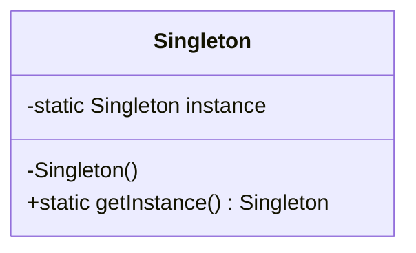

# 2.1 单例模式 (Singleton Pattern)

> 确保一个类只有一个实例，并提供一个全局访问点。

---

## 1. 解决什么问题

有些对象在整个系统中只应该存在一个，比如：
- **配置管理器** — 所有地方读同一份配置
- **数据库连接池** — 不能每次请求都创建一个新池
- **日志对象** — 全局共享一个 Logger
- **Spring Bean** — 默认就是单例

如果不控制，每次 `new` 都会创建新实例：

```java
Config a = new Config();  // 实例1
Config b = new Config();  // 实例2
// a 和 b 是不同对象，修改 a 不影响 b，数据不一致
```

单例模式的目标：**不管谁来要，拿到的都是同一个对象。**

---

## 2. 角色与结构

单例模式只有一个角色：**Singleton 自己**。

类图：


三个要素：
1. **私有构造方法** — 外部不能 `new`
2. **静态私有实例** — 自己持有唯一实例
3. **静态公开方法** — 提供全局访问点

---

## 3. 五种实现方式

### 3.1 饿汉式 — 最简单

类加载时就创建实例，不管你用不用。

```java
public class Singleton {
    // 类加载时就创建，线程安全（JVM 保证）
    private static final Singleton INSTANCE = new Singleton();

    private Singleton() {}

    public static Singleton getInstance() {
        return INSTANCE;
    }
}
```

| 优点 | 缺点 |
|---|---|
| 简单，天然线程安全 | 类加载就创建，如果一直没用就浪费内存 |

实际开发中大多数情况用这个就够了，除非实例创建成本很高。

### 3.2 懒汉式 — 用的时候再创建

```java
public class Singleton {
    private static Singleton instance;

    private Singleton() {}

    public static Singleton getInstance() {
        if (instance == null) {
            instance = new Singleton();
        }
        return instance;
    }
}
```

| 优点 | 缺点 |
|---|---|
| 延迟加载，不浪费 | **线程不安全** — 两个线程同时判断为 null，会创建两个实例 |

多线程环境下不能用这个写法。

### 3.3 双重检查锁（DCL）— 面试最爱问

```java
public class Singleton {
    // volatile 防止指令重排序
    private static volatile Singleton instance;

    private Singleton() {}

    public static Singleton getInstance() {
        if (instance == null) {                // 第一次检查：避免每次都加锁
            synchronized (Singleton.class) {
                if (instance == null) {         // 第二次检查：防止重复创建
                    instance = new Singleton();
                }
            }
        }
        return instance;
    }
}
```

**为什么要两次检查？**

```
线程A：第一次检查 null → 拿到锁 → 第二次检查 null → 创建实例 → 释放锁
线程B：第一次检查 null → 等锁 → 拿到锁 → 第二次检查 不为null → 直接返回
```

没有第二次检查，线程B拿到锁后还是会再创建一个。

**为什么要 volatile？**

`instance = new Singleton()` 不是原子操作，实际上分三步：
1. 分配内存
2. 初始化对象
3. 把引用指向内存地址

JVM 可能重排序为 1→3→2，另一个线程在步骤3之后、步骤2之前读到 instance 不为 null，但对象还没初始化完，拿到的是一个半成品。`volatile` 禁止这种重排序。

### 3.4 静态内部类 — 推荐写法

```java
public class Singleton {
    private Singleton() {}

    // 内部类在第一次使用时才加载
    private static class Holder {
        private static final Singleton INSTANCE = new Singleton();
    }

    public static Singleton getInstance() {
        return Holder.INSTANCE;
    }
}
```

| 优点 | 缺点 |
|---|---|
| 延迟加载 + 线程安全 + 无锁 | 无法传构造参数 |

原理：JVM 保证类加载是线程安全的，而 `Holder` 类只有在调用 `getInstance()` 时才会被加载，所以既延迟又安全。

### 3.5 枚举 — 最安全

```java
public enum Singleton {
    INSTANCE;

    public void doSomething() {
        System.out.println("业务方法");
    }
}

// 使用
Singleton.INSTANCE.doSomething();
```

| 优点 | 缺点 |
|---|---|
| 线程安全、防反射攻击、防反序列化破坏 | 写法不直观，不能继承 |

《Effective Java》推荐的方式。但实际开发中用得少，因为写法不像传统类。

---

## 4. 五种方式对比

| 方式 | 线程安全 | 延迟加载 | 防反射 | 推荐程度 |
|---|---|---|---|---|
| 饿汉式 | 是 | 否 | 否 | 简单场景首选 |
| 懒汉式 | **否** | 是 | 否 | 不推荐 |
| 双重检查锁 | 是 | 是 | 否 | 面试常考 |
| 静态内部类 | 是 | 是 | 否 | 推荐 |
| 枚举 | 是 | 否 | **是** | 最安全 |

实际开发中：
- 大多数场景 → **饿汉式**（够用了）
- 需要延迟加载 → **静态内部类**
- 面试 → **双重检查锁**（考你对 volatile、synchronized 的理解）

---

## 5. Spring 中的单例

Spring Bean 默认是单例的，但和设计模式的单例不是一回事：

| | 设计模式单例 | Spring 单例 |
|---|---|---|
| 谁保证唯一 | 类自己（私有构造方法） | Spring 容器（IoC） |
| 唯一的范围 | 整个 JVM | 一个 ApplicationContext 内 |
| 实现方式 | 类内部控制 | 容器用 Map 缓存 |

Spring 的做法简化后：

```java
// Spring 容器内部简化逻辑
public class DefaultSingletonBeanRegistry {
    // 一级缓存：存所有单例 Bean
    private final Map<String, Object> singletonObjects = new ConcurrentHashMap<>();

    public Object getSingleton(String beanName) {
        Object bean = singletonObjects.get(beanName);
        if (bean == null) {
            bean = createBean(beanName);
            singletonObjects.put(beanName, bean);  // 放进缓存
        }
        return bean;
    }
}
```

本质就是一个 Map，key 是 Bean 名字，value 是实例。第一次 get 时创建并缓存，之后直接返回缓存的。

---

## 6. 优缺点

### 6.1 优点
- **全局唯一**：保证只有一个实例，数据一致。
- **节省资源**：避免重复创建开销大的对象。
- **全局访问**：通过静态方法随处可用。

### 6.2 缺点
- **隐藏依赖**：代码里到处 `getInstance()`，依赖关系不明显。
- **难以测试**：全局状态导致测试之间互相影响。
- **违反单一职责**：一个类既管业务又管自己的创建。

这也是为什么 Spring 不用设计模式的单例，而是用容器来管理 — 把"保证唯一"的职责从类自身移到了容器。

---

## 7. 小结

单例模式是最简单的设计模式，核心就一句话：**私有构造 + 静态方法返回唯一实例**。

实际开发中，你很少需要自己写单例，因为 Spring 容器已经帮你做了。但理解单例的实现方式，尤其是双重检查锁，对理解并发编程很有帮助。
