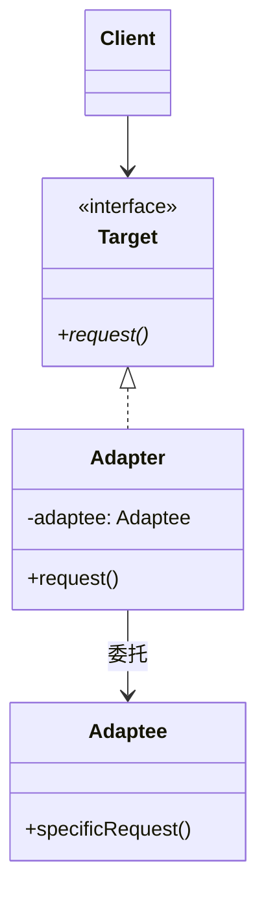

# 3.1 适配器模式 (Adapter Pattern)

> 把一个类的接口"翻译"成客户端期望的另一个接口，让原本因接口不兼容而无法协作的两个类能一起工作。

---

## 1. 解决什么问题

你在项目里用了一套**统一的支付接口**：

```java
public interface Payment {
    void pay(BigDecimal amount);
}
```

所有业务代码都依赖这个接口。突然产品经理说："接入微信支付吧。"

你去看微信 SDK，发现它长这样：

```java
// 第三方 SDK，源码你改不了
public class WechatPaySdk {
    public void sendMoney(double yuan, String openId) { /* ... */ }
}
```

问题来了：
- **接口不兼容**：你要的是 `pay(BigDecimal)`，人家给你的是 `sendMoney(double, String)`
- **源码不可改**：第三方 SDK 是 jar 包，没法去改它
- **业务代码不能动**：你已经有几百个地方调用 `Payment.pay()`，不可能为了一个微信支付重构全部

> **核心矛盾：客户端期望的接口 ≠ 现有的接口，而两边都不能改。**

适配器模式就是为了解决这种"系统对接"的接口不匹配问题。

---

## 2. 适配器的思路

**生活类比 —— 电源转换插头**：

```
你的笔记本（两脚插头）  →  转换器  →  英国插座（三脚）
                          ↑
               它不发电，也不耗电，
               只负责"接口形状的翻译"
```

转换器自己不产生任何价值（既不发电也不储电），它唯一的作用就是**让两边接口形状能对上**。

抽象一下：

```
Client（客户端）
   │
   │ 我只认识 Target 接口
   ▼
Target（目标接口） ← 期望的形状
   │
   │ 被一个 Adapter 实现
   ▼
Adapter（适配器） ─持有─→ Adaptee（被适配者，实际干活的）
                          这位才是真正干活的，
                          但他的接口形状跟 Target 对不上
```

**关键点：Adapter 实现 Target 接口，内部委托给 Adaptee 完成真正的工作，只做接口形状的翻译。**

---

## 3. 角色与结构

- **Target（目标接口）**：客户端期望的接口形状。
- **Adaptee（被适配者）**：已存在的、接口不兼容的类，通常是第三方代码、遗留代码。
- **Adapter（适配器）**：实现 Target，内部持有 Adaptee 引用，把 Target 的调用翻译成 Adaptee 的调用。
- **Client（客户端）**：只依赖 Target 接口，对 Adapter 和 Adaptee 都无感知。

类图：



---

## 4. 两种实现方式

适配器分**对象适配器**（组合）和**类适配器**（继承）两种。

### 4.1 对象适配器（推荐，组合方式）

Adapter **持有** Adaptee 的引用：

```java
// Target —— 我们系统的统一支付接口
public interface Payment {
    void pay(BigDecimal amount);
}

// Adaptee —— 第三方微信 SDK，接口对不上
public class WechatPaySdk {
    public void sendMoney(double yuan, String openId) {
        System.out.println("微信支付了 " + yuan + " 元给 " + openId);
    }
}

// Adapter —— 翻译层
// 设计意图：
//   1. 实现 Target，保证 Client 能无缝调用
//   2. 内部组合 Adaptee，把"统一接口"翻译成"具体 SDK 的调用"
//   3. 翻译过程中可能需要补全参数、做类型转换、做单位换算
public class WechatPaymentAdapter implements Payment {
    private final WechatPaySdk wechatSdk;
    private final String openId;  // 微信 SDK 多需要的参数，由 Adapter 注入

    public WechatPaymentAdapter(WechatPaySdk wechatSdk, String openId) {
        this.wechatSdk = wechatSdk;
        this.openId = openId;
    }

    @Override
    public void pay(BigDecimal amount) {
        // 类型适配：BigDecimal → double
        double yuan = amount.doubleValue();
        // 参数适配：补上 SDK 需要、但 Target 接口里没有的 openId
        wechatSdk.sendMoney(yuan, openId);
    }
}

// Client —— 完全无感知
public class OrderService {
    private final Payment payment;  // 只认 Target 接口

    public OrderService(Payment payment) {
        this.payment = payment;
    }

    public void checkout(BigDecimal amount) {
        payment.pay(amount);  // 调用谁？不关心
    }
}

// 装配
Payment wechat = new WechatPaymentAdapter(new WechatPaySdk(), "user_openid_123");
new OrderService(wechat).checkout(new BigDecimal("99.5"));
```

### 4.2 类适配器（多继承，不推荐）

Adapter **继承** Adaptee，同时实现 Target：

```java
// 类适配器：继承 Adaptee + 实现 Target
public class WechatPaymentClassAdapter extends WechatPaySdk implements Payment {
    private final String openId;

    public WechatPaymentClassAdapter(String openId) {
        this.openId = openId;
    }

    @Override
    public void pay(BigDecimal amount) {
        // 直接调用继承自父类的方法
        sendMoney(amount.doubleValue(), openId);
    }
}
```

**问题**：
- Java 是**单继承**语言，一旦 `extends WechatPaySdk`，这个适配器就不能再继承别的类了
- 把 Adaptee 的所有 `public` 方法都暴露给了 Client（破坏封装）
- 编译期绑定，无法在运行时切换 Adaptee

> **结论：Java 中几乎总是用对象适配器。类适配器只在多继承的语言（如 C++）里才有意义。**

---

## 5. 框架中的实际应用

### 5.1 Java I/O —— `InputStreamReader`

经典例子：把**字节流**适配成**字符流**。

```java
// Adaptee：InputStream，只能读字节
InputStream byteStream = new FileInputStream("a.txt");

// Adapter：InputStreamReader，让字节流"看起来像"字符流
// 内部干的活：从 InputStream 读字节 → 按指定编码解码 → 输出字符
Reader charStream = new InputStreamReader(byteStream, "UTF-8");

// Client：BufferedReader 只认 Reader 接口
BufferedReader br = new BufferedReader(charStream);
```

- **Target**：`Reader`（字符流接口）
- **Adaptee**：`InputStream`（字节流）
- **Adapter**：`InputStreamReader`，组合 `InputStream`，在 `read()` 时完成字节→字符的解码翻译

这是对象适配器的教科书级范例。

### 5.2 Spring MVC —— `HandlerAdapter`

Spring MVC 的核心枢纽是 `DispatcherServlet`，但它要处理多种风格的 Controller：

- 注解风格：`@RequestMapping` 标注的方法（`RequestMappingHandlerMethod`）
- 老式接口：`implements Controller` 的类
- HTTP 请求处理器：`HttpRequestHandler`
- Servlet 适配：`Servlet` 接口本身

这些类**没有统一的方法签名**，`DispatcherServlet` 没法直接调它们。Spring 抽象出 `HandlerAdapter`：

```java
public interface HandlerAdapter {
    boolean supports(Object handler);  // 我能不能处理这个 handler
    ModelAndView handle(HttpServletRequest req, HttpServletResponse resp, Object handler);
}
```

每种 Controller 风格对应一个 Adapter（如 `RequestMappingHandlerAdapter`），把 `DispatcherServlet` 的统一调用翻译成对具体 Controller 的调用。

这是适配器模式在框架里"**打通异构组件**"的典型用法。

### 5.3 日志门面 SLF4J

`slf4j-log4j12`、`slf4j-jdk14` 这些桥接包，本质都是把 `org.slf4j.Logger` 适配到具体日志实现（Log4j、JUL）的 API 上。

---

## 6. 工程权衡

### 优点
- **复用遗留代码**：不改老代码、不改第三方代码，就能让它接入新系统
- **解耦客户端与具体实现**：Client 只依赖 Target，Adaptee 可以随便换
- **符合开闭原则**：新增一种 Adaptee 只需写一个新 Adapter，不动现有代码

### 代价
- **多一层间接调用**：性能上有微小开销（几乎可忽略）
- **类数量增加**：每接入一种异构系统就要加一个 Adapter
- **过度使用会让系统难以追踪**：调用链经过太多 Adapter 时，debug 时跳来跳去

### 与其他"包装类"模式的对比

适配器、装饰器、代理三者结构上极其相似（都是「包一层」），区别在**意图**：

| 模式 | 接口是否变化 | 核心意图 | 类比 |
|---|---|---|---|
| **适配器** | **变**（A → B） | 让接口不兼容的类能协作 | 电源转换插头 |
| **装饰器** | **不变**（A → A） | 给对象动态叠加功能 | 给咖啡加奶、加糖 |
| **代理** | **不变**（A → A） | 控制对对象的访问（权限/缓存/远程） | 明星的经纪人 |

**记忆口诀**：
- 接口**变形**的是**适配器**
- 接口不变但**增强**的是**装饰器**
- 接口不变但**控制**的是**代理**

### 适配器 vs 外观（Facade）

容易混淆，但目的不同：

- **适配器**：解决**接口不匹配**（已有 Target 接口，要让 Adaptee 实现它）
- **外观**：解决**接口过复杂**（没有现成接口，自己设计一个简化的入口，封装多个子系统）

外观是「化繁为简」，适配器是「形状翻译」。

---

## 7. 深度联想

### 7.1 适配器思想在工程中无处不在

只要你听到这些词，背后基本都是适配器思想：
- **桥接 (Bridge)**：SLF4J 桥接包、JDBC Driver
- **网关 (Gateway)**：API Gateway 把内部协议适配成外部 HTTP/REST
- **DTO 转换**：把 Entity 翻译成前端要的 VO，本质也是数据结构层面的适配
- **OS 驱动**：把硬件厂商的私有协议适配成 OS 标准接口（块设备、字符设备）

广义来说，**所有"协议转换"层都是适配器**。

### 7.2 适配器与依赖倒置

适配器模式是**依赖倒置原则 (DIP)** 的天然产物：

```
高层模块 (Client)  ──依赖──→  抽象 (Target)
                                  ↑
                                实现
                                  │
                               Adapter ──→ 底层模块 (Adaptee)
```

Client 不依赖具体的 Adaptee，而是依赖抽象 Target。Adapter 把这种依赖关系"扭过来"。理解了适配器，就理解了 DIP 在实际工程中是怎么落地的。

### 7.3 思考题

1. **如果业务又要接入支付宝、银联、PayPal，每个 SDK 接口都不一样，你会怎么组织代码？** 提示：适配器 + 工厂 + 策略，能不能组合起来用？

2. **`InputStreamReader` 内部如何处理"半个字符"？** 例如 UTF-8 中一个汉字占 3 字节，如果一次 `read` 只读到了 2 字节，Reader 应该怎么办？这背后涉及"流式适配"中的状态保持问题。

3. **如果 Adaptee 抛出的异常类型和 Target 接口约定的异常类型不一样，Adapter 应该怎么处理？** 这是一个真实项目里非常常见的"异常适配"问题。
