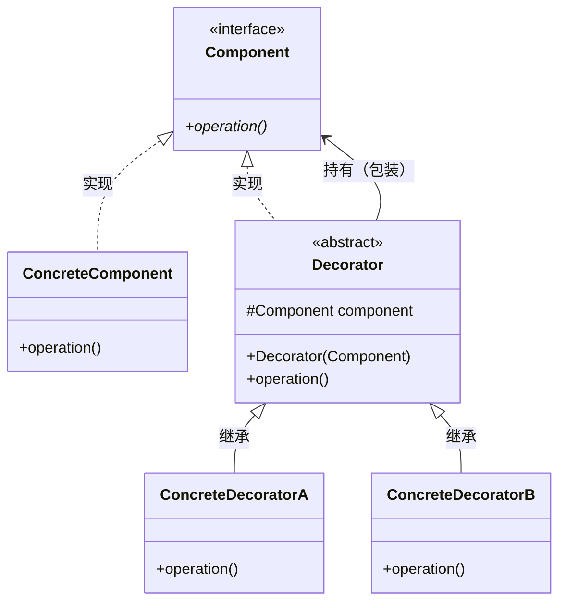
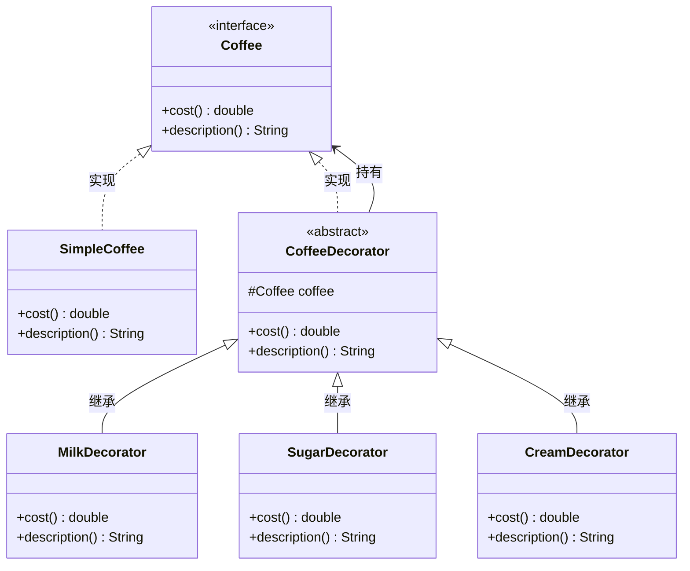
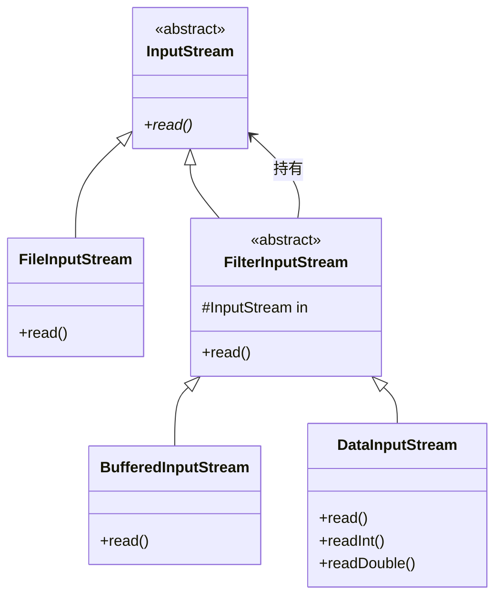

# 3.2 装饰器模式 (Decorator Pattern)

> 在不改变原有对象的基础上，动态地给对象叠加额外功能。

---

## 1. 解决什么问题

你想给一个对象加功能，最直接的方式是继承：

```java
// 基础：普通咖啡
class Coffee { double cost() { return 10; } }

// 加牛奶：继承
class CoffeeWithMilk extends Coffee { double cost() { return 10 + 3; } }

// 加糖：继承
class CoffeeWithSugar extends Coffee { double cost() { return 10 + 2; } }

// 加牛奶 + 加糖：又要一个类
class CoffeeWithMilkAndSugar extends Coffee { double cost() { return 10 + 3 + 2; } }

// 加牛奶 + 加糖 + 加奶油：又要一个类...
```

问题：
- **类爆炸**：N 种配料的组合是 2^N 个类
- **不灵活**：组合关系在编译时就定死了，运行时不能动态调整
- **违反开闭原则**：每加一种配料，可能要新增多个组合类

---

## 2. 装饰器的思路

不用继承，而是**一层套一层**：

```
普通咖啡                    → 10 元
套一层牛奶装饰(普通咖啡)      → 10 + 3 = 13 元
套一层糖装饰(牛奶(普通咖啡))  → 10 + 3 + 2 = 15 元
```

每一层装饰器只负责自己那部分功能，想加什么就套什么，运行时自由组合。

---

## 3. 角色与结构

- **Component（组件接口）**：定义核心功能。
- **ConcreteComponent（具体组件）**：被装饰的原始对象。
- **Decorator（装饰器基类）**：持有一个 Component 引用，实现相同接口。
- **ConcreteDecorator（具体装饰器）**：在调用被装饰对象的基础上，叠加额外功能。

类图：


关键点：**Decorator 既实现了 Component 接口，又持有一个 Component 引用。** 这意味着装饰器可以套装饰器，无限叠加。

---

## 4. Java 示例：咖啡加配料

```java
// 组件接口
public interface Coffee {
    double cost();
    String description();
}

// 具体组件：基础咖啡
public class SimpleCoffee implements Coffee {
    @Override
    public double cost() {
        return 10;
    }

    @Override
    public String description() {
        return "普通咖啡";
    }
}

// 装饰器基类
public abstract class CoffeeDecorator implements Coffee {
    protected Coffee coffee;  // 持有被装饰对象

    public CoffeeDecorator(Coffee coffee) {
        this.coffee = coffee;
    }

    @Override
    public double cost() {
        return coffee.cost();  // 默认委托给被装饰对象
    }

    @Override
    public String description() {
        return coffee.description();
    }
}

// 具体装饰器：加牛奶
public class MilkDecorator extends CoffeeDecorator {
    public MilkDecorator(Coffee coffee) {
        super(coffee);
    }

    @Override
    public double cost() {
        return coffee.cost() + 3;  // 在原有基础上 + 3
    }

    @Override
    public String description() {
        return coffee.description() + " + 牛奶";
    }
}

// 具体装饰器：加糖
public class SugarDecorator extends CoffeeDecorator {
    public SugarDecorator(Coffee coffee) {
        super(coffee);
    }

    @Override
    public double cost() {
        return coffee.cost() + 2;
    }

    @Override
    public String description() {
        return coffee.description() + " + 糖";
    }
}

// 具体装饰器：加奶油
public class CreamDecorator extends CoffeeDecorator {
    public CreamDecorator(Coffee coffee) {
        super(coffee);
    }

    @Override
    public double cost() {
        return coffee.cost() + 5;
    }

    @Override
    public String description() {
        return coffee.description() + " + 奶油";
    }
}
```

客户端使用 — 运行时自由组合：

```java
public class Client {
    public static void main(String[] args) {
        // 普通咖啡
        Coffee coffee = new SimpleCoffee();
        System.out.println(coffee.description() + " = " + coffee.cost());
        // 普通咖啡 = 10.0

        // 加牛奶
        coffee = new MilkDecorator(coffee);
        System.out.println(coffee.description() + " = " + coffee.cost());
        // 普通咖啡 + 牛奶 = 13.0

        // 再加糖
        coffee = new SugarDecorator(coffee);
        System.out.println(coffee.description() + " = " + coffee.cost());
        // 普通咖啡 + 牛奶 + 糖 = 15.0

        // 再加奶油
        coffee = new CreamDecorator(coffee);
        System.out.println(coffee.description() + " = " + coffee.cost());
        // 普通咖啡 + 牛奶 + 糖 + 奶油 = 20.0

        // 甚至可以加双份牛奶
        Coffee doubleMilk = new MilkDecorator(new MilkDecorator(new SimpleCoffee()));
        System.out.println(doubleMilk.description() + " = " + doubleMilk.cost());
        // 普通咖啡 + 牛奶 + 牛奶 = 16.0
    }
}
```

示例类图：


---

## 5. Java I/O 流 — 最经典的装饰器

Java I/O 的设计就是装饰器模式：

```java
// 一层套一层
InputStream in = new BufferedInputStream(      // 装饰器3：加缓冲
                    new DataInputStream(       // 装饰器2：加读取基本类型
                        new FileInputStream("data.txt")  // 原始组件
                    )
                 );
```

对应关系：

| I/O 类 | 装饰器角色 |
|---|---|
| `InputStream` | Component（接口） |
| `FileInputStream` | ConcreteComponent（原始组件） |
| `FilterInputStream` | Decorator（装饰器基类） |
| `BufferedInputStream` | ConcreteDecorator（加缓冲） |
| `DataInputStream` | ConcreteDecorator（加读基本类型） |



这就是为什么 Java I/O 要一层套一层 — 不是设计复杂，而是让你按需组合。

---

## 6. 与继承的对比

| | 继承 | 装饰器 |
|---|---|---|
| 扩展时机 | 编译时 | 运行时 |
| 组合方式 | 每种组合一个子类 | 随意嵌套 |
| 类的数量 | 组合爆炸（2^N） | 线性增长（N） |
| 灵活性 | 固定 | 动态增减 |

3 种配料：
- 继承：最多 2^3 = 8 个类
- 装饰器：3 个装饰器类，运行时随意组合

---

## 7. 与其他模式的区别

| 模式 | 做什么 | 怎么做 |
|---|---|---|
| **装饰器** | 给对象**加功能** | 套一层，增强原有行为 |
| **代理模式** | **控制**对对象的访问 | 套一层，但不增强功能，而是加权限、缓存、日志等 |
| **策略模式** | **替换**算法 | 不是套一层，而是换一个 |
| **适配器模式** | **转换**接口 | 套一层，让不兼容的接口能一起工作 |

装饰器和代理结构几乎一模一样（都是套一层），区别在意图：
- 装饰器：**增强** — "我要给咖啡加牛奶"
- 代理：**控制** — "我要在调用前做权限检查"

---

## 8. 优缺点

### 8.1 优点
- **灵活组合**：运行时动态叠加功能，比继承灵活得多。
- **单一职责**：每个装饰器只负责一种增强。
- **开闭原则**：新增装饰器不影响已有代码。

### 8.2 缺点
- **嵌套深了不好读**：`new A(new B(new C(new D())))` 一眼看不出来干了什么。
- **调试困难**：调用链层层包裹，定位问题要一层层拆。

---

## 9. 小结

装饰器模式的核心价值是**用组合代替继承，动态地给对象叠加功能**。

第一阶段五个模式的对比：

| 模式 | 类型 | 核心思路 | 解决的问题 |
|---|---|---|---|
| **单例** | 创建型 | 私有构造 + 全局访问 | 保证全局唯一 |
| **工厂方法** | 创建型 | 接口创建对象 | 解耦对象的创建与使用 |
| **策略** | 行为型 | 算法可替换 | 消除 if-else |
| **观察者** | 行为型 | 一对多通知 | 事件发布与处理解耦 |
| **装饰器** | 结构型 | 一层套一层 | 动态叠加功能，避免类爆炸 |
