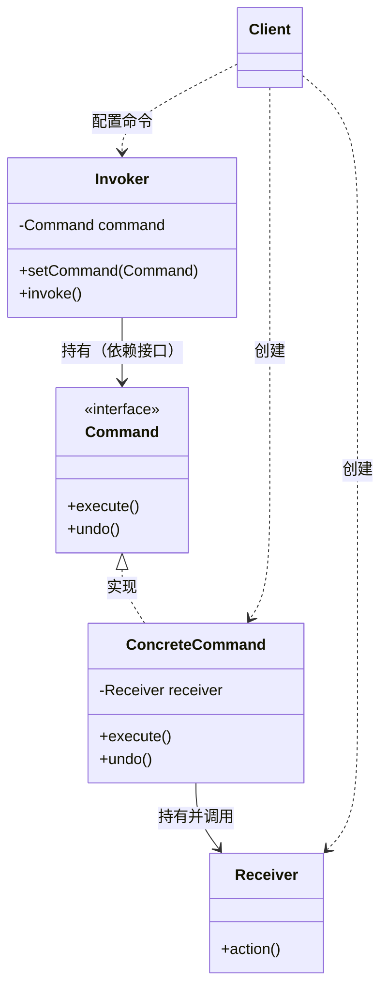
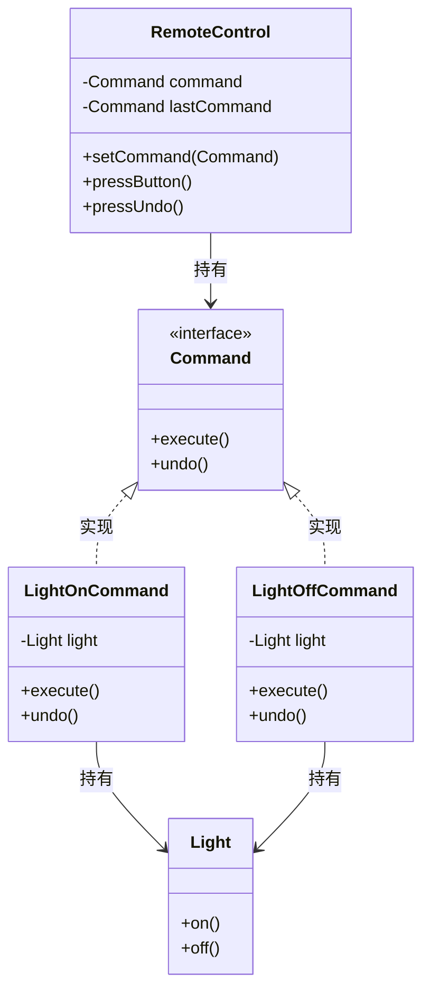

# 3.3.1 命令模式 (Command Pattern)

> 将一个请求封装为对象，从而让你用不同的请求对客户进行参数化，并支持队列、日志与撤销等操作。

---

## 1. 模式意图
命令模式把“发起请求”和“执行请求”解耦：调用者只负责触发命令，不需要知道命令内部如何完成，命令本身携带执行所需的一切信息。

---

## 2. 角色与结构
- **Command（命令接口）**：定义统一的执行入口（如 `execute()`，可扩展 `undo()`）。
- **ConcreteCommand（具体命令）**：绑定接收者并实现具体动作。
- **Receiver（接收者）**：真正执行业务逻辑的对象。
- **Invoker（调用者）**：持有命令并在合适时机触发。
- **Client（客户端）**：创建具体命令并把接收者绑定到命令上。

类图（Mermaid）：


以遥控器示例展开：


---

## 3. 适用场景
- 需要**将操作参数化**（同一按钮可绑定不同操作）。
- 需要**支持撤销/重做**、**请求队列**或**日志记录**。
- 需要**解耦调用者与执行者**，避免调用者直接依赖具体业务对象。

---

## 4. 优缺点
### 4.1 优点
- **解耦**：调用者不依赖具体接收者。
- **可扩展**：新增命令不影响已有代码（开闭原则）。
- **易组合**：可做宏命令、队列、延迟执行。

### 4.2 缺点
- **类数量增加**：一个动作通常对应一个命令类。
- **结构更复杂**：对小项目可能显得过度设计。

---

## 5. Java 示例：遥控器控制灯

**场景**：遥控器只有“按键”，具体是开灯还是关灯由命令决定。

```java
// 命令接口
public interface Command {
    void execute();
    void undo();
}

// 接收者
public class Light {
    public void on() {
        System.out.println("Light is ON");
    }
    public void off() {
        System.out.println("Light is OFF");
    }
}

// 具体命令：开灯
public class LightOnCommand implements Command {
    private final Light light;
    public LightOnCommand(Light light) {
        this.light = light;
    }
    public void execute() {
        light.on();
    }
    public void undo() {
        light.off();
    }
}

// 具体命令：关灯
public class LightOffCommand implements Command {
    private final Light light;
    public LightOffCommand(Light light) {
        this.light = light;
    }
    public void execute() {
        light.off();
    }
    public void undo() {
        light.on();
    }
}

// 调用者：遥控器
public class RemoteControl {
    private Command command;
    private Command lastCommand;

    public void setCommand(Command command) {
        this.command = command;
    }

    public void pressButton() {
        if (command != null) {
            command.execute();
            lastCommand = command;
        }
    }

    public void pressUndo() {
        if (lastCommand != null) {
            lastCommand.undo();
        }
    }
}

// 客户端
public class Client {
    public static void main(String[] args) {
        Light light = new Light();
        RemoteControl remote = new RemoteControl();

        remote.setCommand(new LightOnCommand(light));
        remote.pressButton(); // Light is ON

        remote.setCommand(new LightOffCommand(light));
        remote.pressButton(); // Light is OFF

        remote.pressUndo();   // Light is ON
    }
}
```

---

## 6. 与其他模式的区别
- **策略模式**：关注“算法可替换”，通常由上下文选择策略执行；命令模式关注“请求封装”。
- **备忘录模式**：常与命令模式结合实现撤销/恢复。
- **责任链模式**：请求在链上流转；命令模式是请求封装后交给单个命令执行。

---

## 7. 小结
命令模式的核心价值是**解耦调用者与执行者**，并为撤销、队列、日志等能力提供统一的扩展点。当系统需要对操作进行统一抽象与管理时，它是非常合适的选择。
