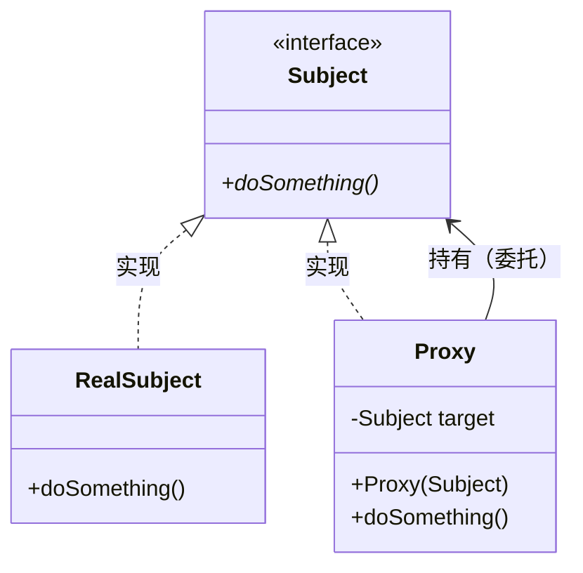

# 3.3 代理模式 (Proxy Pattern)

> 在不修改目标对象代码的前提下，通过一个"替身"来控制对目标对象的访问，从而附加额外的行为。

---

## 1. 解决什么问题

你写了一个 `UserService`，里面有个 `findUser()` 方法。现在老板说：加日志、加权限、加性能监控。

最直觉的做法 —— 直接改源码：

```java
public User findUser(Long id) {
    log.info("开始查询...");           // 日志 —— 不是核心逻辑
    checkPermission();                  // 权限 —— 不是核心逻辑
    long start = System.currentTimeMillis(); // 监控 —— 不是核心逻辑

    User user = userDao.findById(id);   // ← 这才是真正的业务逻辑

    log.info("查询耗时: {}ms", ...);    // 又不是核心逻辑
    return user;
}
```

问题：
- **违反单一职责原则**：业务代码和"横切关注点"(cross-cutting concerns) 搅在一起
- **违反开闭原则**：每加一个需求就要改源码，改 100 个方法就要改 100 次
- **代码重复**：日志、权限的代码在每个方法里复制粘贴

---

## 2. 代理的思路

**你以为你在调用真正的对象，其实你调用的是一个"中间人"。**

生活类比 —— **明星与经纪人**：

```
你（客户端）  →  经纪人（代理）  →  明星（真实对象）
```

经纪人做了什么？
- 前置处理：审核资质，谈价格、档期（权限校验）
- 转发请求：安排明星去演出（调用真实对象）
- 后置处理：收款、签合同、安排宣传（日志、监控）

关键点：**对你来说，经纪人和明星提供的"服务"是一样的**（都是"接演出"），但经纪人在前后加了控制逻辑。

---

## 3. 角色与结构

- **Subject（共同接口）**：代理和真实对象的"契约"
- **RealSubject（真实对象）**：只关心业务逻辑
- **Proxy（代理对象）**：持有真实对象引用，在调用前后附加行为

```
         ┌──────────────────────────────────┐
         │          共同接口 (Subject)        │
         │       + doSomething()             │
         └──────────┬───────────────────┬────┘
                    │                   │
                    ▼                   ▼
          ┌─────────────────┐  ┌─────────────────┐
          │   Proxy（代理）   │  │ RealSubject（真实）│
          │                 │  │                  │
          │ - 前置增强       │  │ - 真正的业务逻辑  │
          │ - 调用真实对象 ──┼──▶                  │
          │ - 后置增强       │  │                  │
          └─────────────────┘  └─────────────────┘
```

核心约束：**代理和真实对象必须实现同一个接口**，客户端才能无缝替换。

类图：


---

## 4. 三种实现方式

代理模式有三种逐步进化的形态：

| 形态 | 原理 | 特点 |
|------|------|------|
| **静态代理** | 手写代理类 | 简单直观，但每个类都要写一个代理 |
| **JDK 动态代理** | 运行时通过反射生成代理类 | 目标必须实现接口 |
| **CGLIB 动态代理** | 运行时通过字节码生成子类 | 不需要接口，通过继承实现 |

### 4.1 静态代理 —— 理解原理

```java
// ========== 1. 共同接口 ==========
public interface UserService {
    User findUser(Long id);
    void saveUser(User user);
}

// ========== 2. 真实对象 —— 只关心业务逻辑 ==========
public class UserServiceImpl implements UserService {
    @Override
    public User findUser(Long id) {
        return userDao.findById(id);
    }

    @Override
    public void saveUser(User user) {
        userDao.save(user);
    }
}

// ========== 3. 代理对象 —— 控制访问，附加行为 ==========
public class UserServiceProxy implements UserService {

    // 持有真实对象的引用 —— 代理模式的核心
    private final UserService target;

    public UserServiceProxy(UserService target) {
        this.target = target;
    }

    @Override
    public User findUser(Long id) {
        System.out.println("[LOG] findUser 开始, id=" + id);  // 前置增强
        long start = System.currentTimeMillis();

        User user = target.findUser(id);  // 委托给真实对象

        long cost = System.currentTimeMillis() - start;
        System.out.println("[LOG] findUser 结束, 耗时=" + cost + "ms");  // 后置增强
        return user;
    }

    @Override
    public void saveUser(User user) {
        // 每个方法都要手写一遍增强逻辑 —— 这就是静态代理的痛点！
        System.out.println("[LOG] saveUser 开始");
        target.saveUser(user);
        System.out.println("[LOG] saveUser 结束");
    }
}

// ========== 4. 客户端使用 —— 完全无感知 ==========
public class Client {
    public static void main(String[] args) {
        UserService real = new UserServiceImpl();
        UserService proxy = new UserServiceProxy(real);  // 套上代理

        // 客户端以为自己在调用真实对象，实际调用的是代理
        proxy.findUser(1L);
    }
}
```

**静态代理的致命问题：** 如果 `UserService` 有 20 个方法，代理类里要重写 20 遍。如果有 50 个 Service 类，就要写 50 个代理类。不可接受。

### 4.2 JDK 动态代理 —— 运行时自动生成

```java
import java.lang.reflect.InvocationHandler;
import java.lang.reflect.Method;
import java.lang.reflect.Proxy;

// ========== 核心：InvocationHandler —— 所有方法调用的"拦截器" ==========
public class LoggingHandler implements InvocationHandler {

    private final Object target;  // 真实对象（用 Object 类型，通用于任何类）

    public LoggingHandler(Object target) {
        this.target = target;
    }

    /**
     * 每当代理对象的任何方法被调用时，都会转发到这里
     *
     * @param proxy  生成的代理对象本身（很少直接用）
     * @param method 被调用的方法（通过反射获取）
     * @param args   方法参数
     */
    @Override
    public Object invoke(Object proxy, Method method, Object[] args) throws Throwable {
        // ---- 前置增强 ----
        System.out.println("[LOG] " + method.getName() + " 开始, 参数=" + java.util.Arrays.toString(args));
        long start = System.currentTimeMillis();

        // ---- 调用真实对象的方法（通过反射） ----
        Object result = method.invoke(target, args);

        // ---- 后置增强 ----
        long cost = System.currentTimeMillis() - start;
        System.out.println("[LOG] " + method.getName() + " 结束, 耗时=" + cost + "ms");

        return result;
    }
}

// ========== 使用 ==========
public class Client {
    public static void main(String[] args) {
        // 1. 创建真实对象
        UserService realService = new UserServiceImpl();

        // 2. JDK 动态生成代理对象（运行时，不需要手写代理类！）
        UserService proxy = (UserService) Proxy.newProxyInstance(
            realService.getClass().getClassLoader(),  // 类加载器
            realService.getClass().getInterfaces(),    // 目标实现的接口数组
            new LoggingHandler(realService)             // 拦截处理器
        );

        // 3. 调用代理 —— 自动触发 invoke()
        proxy.findUser(1L);
        proxy.saveUser(new User("Alice"));

        // 一个 LoggingHandler 可以代理任何接口的任何对象！
    }
}
```

**发生了什么？** JVM 在运行时动态生成了一个类（类似 `$Proxy0`），它实现了 `UserService` 接口，所有方法都转发到 `InvocationHandler.invoke()`。**不需要手写任何代理类。**

### 4.3 CGLIB 动态代理 —— 不需要接口

```java
import net.sf.cglib.proxy.Enhancer;
import net.sf.cglib.proxy.MethodInterceptor;
import net.sf.cglib.proxy.MethodProxy;

// 假设 UserServiceImpl 没有实现任何接口 —— JDK 动态代理就无能为力了
public class UserServiceImpl {
    public User findUser(Long id) {
        return userDao.findById(id);
    }
}

// ========== CGLIB 拦截器 ==========
public class LoggingInterceptor implements MethodInterceptor {

    /**
     * @param obj    CGLIB 生成的代理子类实例
     * @param method 被调用的方法
     * @param args   参数
     * @param proxy  方法代理（用于调用父类方法，比反射更快）
     */
    @Override
    public Object intercept(Object obj, Method method, Object[] args, MethodProxy proxy) throws Throwable {
        System.out.println("[LOG] " + method.getName() + " 开始");

        // 关键区别：调用的是父类（真实对象）的方法，不是反射
        Object result = proxy.invokeSuper(obj, args);

        System.out.println("[LOG] " + method.getName() + " 结束");
        return result;
    }
}

// ========== 使用 ==========
public class Client {
    public static void main(String[] args) {
        Enhancer enhancer = new Enhancer();
        enhancer.setSuperclass(UserServiceImpl.class);  // 设置父类（不是接口！）
        enhancer.setCallback(new LoggingInterceptor());

        // 生成的代理是 UserServiceImpl 的子类
        UserServiceImpl proxy = (UserServiceImpl) enhancer.create();
        proxy.findUser(1L);
    }
}
```

**CGLIB 的原理：** 运行时通过字节码技术生成目标类的**子类**，重写父类方法来插入增强逻辑。所以 `final` 类和 `final` 方法**无法代理**。

---

## 5. JDK 动态代理的底层原理

```
Proxy.newProxyInstance() 被调用
        │
        ▼
JVM 在内存中动态生成字节码（一个新的 .class）
        │
        ▼
这个类实现了你指定的接口（如 UserService）
        │
        ▼
所有方法体的实现都是：调用 InvocationHandler.invoke()
        │
        ▼
通过 ClassLoader 加载到 JVM 中
        │
        ▼
返回这个动态类的实例
```

本质上，JDK 动态代理在运行时做了**手写静态代理时做的事** —— 只不过是自动化的。

CGLIB 更底层：使用 ASM 字节码框架直接操作 `.class` 文件的字节码，生成目标类的子类。

---

## 6. 三种代理的对比

| 维度 | 静态代理 | JDK 动态代理 | CGLIB 动态代理 |
|------|----------|-------------|---------------|
| **实现方式** | 手写代理类 | 反射 + 接口 | 字节码生成子类 |
| **是否需要接口** | 是 | **是** | **否** |
| **性能** | 最快（编译期确定） | 较慢（反射调用） | 快（直接方法调用） |
| **灵活性** | 低（一对一） | 高（通用） | 高（通用） |
| **限制** | 代码膨胀 | 只能代理接口方法 | 不能代理 final 类/方法 |

### Spring 怎么选？

```
Spring AOP 的选择策略：
├── 目标对象实现了接口？ → 默认使用 JDK 动态代理
└── 目标对象没有接口？   → 自动降级为 CGLIB

Spring Boot 2.x 默认：强制使用 CGLIB（即使有接口）
原因：避免类型转换问题，开发体验更一致
```

---

## 7. 与装饰器模式的区别

这两个模式**结构几乎一样**，区别在于**意图**：

| | 代理模式 | 装饰器模式 |
|---|---------|-----------|
| **意图** | **控制访问**（权限、延迟加载） | **增强功能**（叠加新能力） |
| **谁创建真实对象** | 代理自己控制 | 客户端传入 |
| **客户端是否知道** | 通常不知道有代理 | 知道在装饰 |
| **典型场景** | AOP、远程调用、缓存 | Java I/O 流层层包装 |

---

## 8. 在框架中的应用

| 应用 | 代理类型 | 做了什么 |
|------|---------|---------|
| **Spring AOP** | JDK/CGLIB | `@Transactional` 事务管理、`@Cacheable` 缓存 |
| **MyBatis Mapper** | JDK 动态代理 | 你只写接口，MyBatis 用代理生成实现类 |
| **RPC 远程调用** | JDK 动态代理 | Dubbo/Feign 把远程方法调用伪装成本地调用 |
| **Spring Security** | CGLIB | 方法级别的权限拦截 |

---

## 9. @Transactional 自调用失效问题

这是代理模式在 Spring 中**最常踩的坑**。

### 问题场景

```java
@Service
public class OrderService {

    public void createOrder(Order order) {
        this.bindCoupon(order);   // ← 内部调用，事务不会生效！
    }

    @Transactional
    public void bindCoupon(Order order) {
        couponDao.deduct(order.getCouponId());
        orderCouponDao.bindCoupon(order.getId(), order.getCouponId());
        // 抛异常不会回滚！
    }
}
```

### 为什么失效？

**Spring 的 `@Transactional` 是通过代理对象实现的，而 `this.method()` 调用的是原始对象，绕过了代理。**

```
                     Spring 容器
    ┌─────────────────────────────────────────┐
    │                                         │
    │   ┌──────────────┐    ┌──────────────┐  │
    │   │ Proxy (代理)  │    │ Target (原始) │  │
    │   │              │    │              │  │
    │   │ createOrder()│───▶│ createOrder()│  │
    │   │  (无增强)     │    │  {           │  │
    │   │              │    │    this.bindCoupon() ──┐  │
    │   │ bindCoupon() │    │  }           │  │     │  │
    │   │  (有事务增强) │    │              │  │     │  │
    │   │              │    │ bindCoupon() │◀─┘     │  │
    │   │              │    │  (无事务！)   │        │  │
    │   └──────────────┘    └──────────────┘        │
    │         ▲                                     │
    └─────────┼─────────────────────────────────────┘
              │
         Controller 调用的是代理对象
```

调用链路对比：

```
✅ 外部调用 bindCoupon():
   Controller → Proxy.bindCoupon() → [开启事务] → Target.bindCoupon() → [提交/回滚]

❌ 内部 this 调用 bindCoupon():
   Controller → Proxy.createOrder() → Target.createOrder() → this.bindCoupon()
                                                               ↑
                                                     this = Target，不是 Proxy！
                                                     没经过代理，没有事务！
```

### CGLIB 子类视角 —— 为什么 this 不是代理？

```java
// CGLIB 生成的代理子类，伪代码：
class OrderService$$EnhancerByCGLIB extends OrderService {

    @Override
    public void createOrder(Order order) {
        // 没有 @Transactional，直接调父类
        super.createOrder(order);
        // ↑ 进入父类代码后，this 指向父类实例
        //   父类调 this.bindCoupon() 走的是父类自己的方法
        //   不会触发子类（代理）的重写
    }

    @Override
    public void bindCoupon(Order order) {
        // 有 @Transactional，包裹事务逻辑
        beginTransaction();
        super.bindCoupon(order);
        commitTransaction();
    }
}
```

### 解决方案

#### 方案一：注入自身代理（推荐）

```java
@Service
public class OrderService {

    @Autowired
    private OrderService self;  // 拿到的是代理对象

    public void createOrder(Order order) {
        self.bindCoupon(order);  // 通过代理调用，事务生效！
    }

    @Transactional
    public void bindCoupon(Order order) { ... }
}
```

#### 方案二：AopContext 获取当前代理

```java
// 需要先开启 exposeProxy
@EnableAspectJAutoProxy(exposeProxy = true)
@SpringBootApplication
public class Application { }

@Service
public class OrderService {

    public void createOrder(Order order) {
        OrderService proxy = (OrderService) AopContext.currentProxy();
        proxy.bindCoupon(order);  // 事务生效
    }

    @Transactional
    public void bindCoupon(Order order) { ... }
}
```

#### 方案三：拆分到不同类（最干净）

```java
@Service
public class OrderService {

    @Autowired
    private CouponService couponService;

    public void createOrder(Order order) {
        couponService.bindCoupon(order);  // 跨 Bean 调用，必然走代理 ✅
    }
}

@Service
public class CouponService {

    @Transactional
    public void bindCoupon(Order order) { ... }
}
```

#### 方案对比

| 方案 | 优点 | 缺点 |
|------|------|------|
| **注入 self** | 简单直观 | 看起来"奇怪"（自己注入自己） |
| **AopContext** | 无需额外注入 | 需要全局配置，基于 ThreadLocal 有性能开销 |
| **拆分类** | 最干净，符合 SRP | 需要调整代码结构 |

实际工程建议：优先考虑**拆分类**，成本过高时用**注入 self**。

### 不只是事务 —— 所有基于代理的注解都有这个问题

| 注解 | 作用 | 自调用是否失效 |
|------|------|--------------|
| `@Transactional` | 事务管理 | ❌ 失效 |
| `@Cacheable` | 缓存 | ❌ 失效 |
| `@Async` | 异步执行 | ❌ 失效 |
| `@Retryable` | 重试 | ❌ 失效 |

本质原因相同：**它们都是通过 AOP 代理实现的，`this` 调用绕过了代理。**

---

## 10. final 类/方法与代理的冲突

这是代理模式的另一个重要陷阱：**CGLIB 通过继承实现代理，而 `final` 阻止继承。**

### 10.1 final class + @Transactional = 启动报错

```java
@Service
public final class OrderService {  // ← final 类

    @Transactional
    public void createOrder(Order order) { ... }
}
```

启动 Spring Boot，直接抛异常，应用起不来：

```
org.springframework.beans.factory.BeanCreationException:
  Error creating bean with name 'orderService':

Could not generate CGLIB subclass of class OrderService:
  Common causes of this problem include using a final class or a non-visible class

Caused by: java.lang.IllegalArgumentException:
  Cannot subclass final class com.example.OrderService
```

**原因：** CGLIB 试图生成 `class OrderService$$EnhancerByCGLIB extends OrderService`，但 JVM 检测到 `OrderService` 的 `access_flags` 中有 `ACC_FINAL (0x0010)` 标志位，在类加载验证阶段就拒绝了。这是 **JVM 层面的硬约束**，Spring 无法绕过。

**Spring 选择 Fail-Fast（快速失败）而非静默忽略，** 因为宁可启动失败，也不让事务不生效的 Bug 悄悄溜进生产环境。

### 10.2 final method + @Transactional = 静默失效（更危险！）

```java
@Service
public class OrderService {  // 类不是 final，CGLIB 能生成子类

    @Transactional
    public final void createOrder(Order order) {  // 但方法是 final
        // ...
    }
}
```

**这种情况 Spring 不会报错！应用正常启动！但 `@Transactional` 静默失效。**

原因：CGLIB 能生成子类，但 `final` 方法**不能被子类重写**，所以事务增强逻辑根本没有插入的位置：

```java
// CGLIB 生成的子类，伪代码：
class OrderService$$EnhancerByCGLIB extends OrderService {

    // 无法重写 final 方法！这个方法根本不存在于子类中：
    // @Override
    // public final void createOrder(Order order) { ... }  ← JVM 不允许

    // 调用 proxy.createOrder() 时，直接走父类的原始方法
    // 事务增强代码根本没有执行的机会
}
```

### 10.3 对比总结

| 情况 | Spring 启动 | @Transactional 效果 | 危险程度 |
|------|------------|---------------------|---------|
| `final class` | **报错，启动失败** | 无法创建代理 | 低（立刻发现） |
| `final method` | **正常启动** | **静默失效** | **高（生产才发现）** |
| 普通类普通方法 | 正常启动 | 正常生效 | 无 |

### 10.4 常见踩坑场景

**场景一：Kotlin 类默认是 final 的**

```kotlin
// Kotlin 中所有类默认 final！
class OrderService {  // 等价于 Java 的 final class OrderService
    @Transactional
    fun createOrder(order: Order) { ... }
}

// 解决方案一：手动加 open
open class OrderService { ... }

// 解决方案二（推荐）：使用 kotlin-spring 编译器插件
// 自动给 @Service、@Transactional 等标注的类加上 open
// build.gradle.kts:
plugins {
    kotlin("plugin.spring")
}
```

**场景二：Java Record（Java 16+）是隐式 final 的**

```java
// record 天生是 final 的，不能被 CGLIB 代理
public record OrderDTO(Long id, String name) { }
```

**场景三：Lombok 的 `@Value` 会生成 final class**

```java
@Value  // Lombok 的 @Value 会生成 final class！
public class OrderConfig {
    String orderPrefix;
}
// 如果被 Spring 代理（如加了 @ConfigurationProperties），会报错
```

### 10.5 JDK 动态代理能绕过 final 吗？

如果目标类实现了接口，理论上可以用 JDK 动态代理（它不需要继承目标类）：

```java
public interface OrderServiceInterface {
    void createOrder(Order order);
}

@Service
public final class OrderService implements OrderServiceInterface {
    @Transactional
    public void createOrder(Order order) { ... }
}
```

但 Spring Boot 2.x 默认强制使用 CGLIB，需要手动切换：

```properties
# application.properties
spring.aop.proxy-target-class=false  # 改为 JDK 动态代理
```

---

## 11. 优缺点

### 优点
- **开闭原则**：不修改原有代码，通过代理扩展功能
- **单一职责**：业务逻辑和横切关注点分离
- **透明性**：客户端不需要知道代理的存在

### 缺点
- **增加复杂度**：多了一层间接调用，调试链路更长
- **性能开销**：动态代理涉及反射或字节码生成
- **自调用陷阱**：`this` 调用绕过代理，容易踩坑（见第 9 节）
- **final 冲突**：CGLIB 无法代理 final 类/方法（见第 10 节）

---

## 12. 小结

代理模式的核心价值是**在不修改目标对象的前提下，通过"替身"控制访问并附加横切逻辑**。

第二阶段模式对比（持续更新）：

| 模式 | 类型 | 核心思路 | 解决的问题 |
|---|---|---|---|
| **代理** | 结构型 | 替身控制访问 | 横切关注点分离（日志/权限/事务） |
| **装饰器** | 结构型 | 一层套一层 | 动态叠加功能，避免类爆炸 |
| **策略** | 行为型 | 算法可替换 | 消除 if-else |
| **观察者** | 行为型 | 一对多通知 | 事件发布与处理解耦 |
| **命令** | 行为型 | 请求封装为对象 | 解耦调用者与执行者 |
