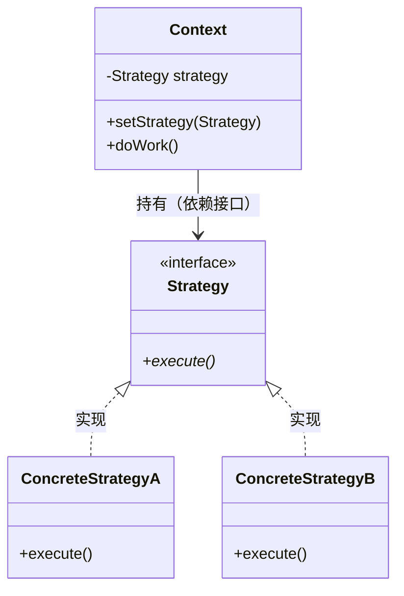
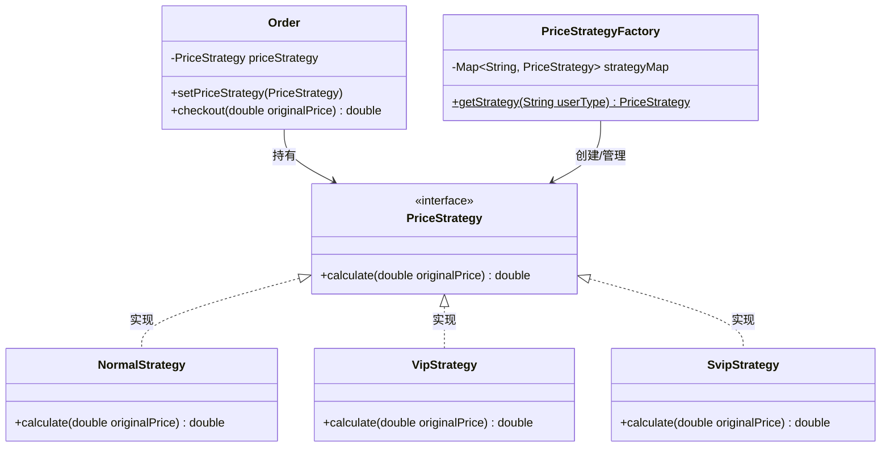

# 4.1 策略模式 (Strategy Pattern)

> 定义一系列算法，把它们各自封装成对象，并使它们可以互相替换。策略模式让算法的变化独立于使用它的客户端。

---

## 1. 解决什么问题

最常见的场景：代码里出现大量 `if-else` 或 `switch` 来选择不同的处理逻辑。

```java
// 没有策略模式：每加一种计算方式，就要改这个方法
public double calculate(String type, double amount) {
    if ("normal".equals(type)) {
        return amount;
    } else if ("vip".equals(type)) {
        return amount * 0.8;
    } else if ("svip".equals(type)) {
        return amount * 0.6;
    }
    // 新增类型？继续加 else if...
    return amount;
}
```

问题：
- **违反开闭原则**：每加一种策略就要修改已有代码
- **方法越来越臃肿**：逻辑全堆在一起
- **无法复用**：某种计算逻辑想在别处用，只能复制粘贴

---

## 2. 角色与结构

- **Strategy（策略接口）**：定义算法的统一入口。
- **ConcreteStrategy（具体策略）**：各自实现不同的算法。
- **Context（上下文）**：持有一个策略引用，把具体计算委托给策略对象。

类图：


核心和命令模式一样：**Context 只依赖 Strategy 接口，不认识任何具体策略。**

---

## 3. 与命令模式的对比

| | 策略模式 | 命令模式 |
|---|---|---|
| 封装的是什么 | **算法**（怎么做） | **请求**（做什么） |
| 中间层的职责 | 提供一种可替换的计算方式 | 把一个动作对象化 |
| 典型用法 | 选一个策略执行 | 存起来，延迟/撤销/排队 |
| 关注点 | **替换** | **记录与回放** |

两者结构很像（都是接口 + 具体实现 + 持有者），但意图不同。

---

## 4. Java 示例：会员折扣计算

**场景**：电商系统，不同会员等级有不同的折扣计算方式。

```java
// 策略接口
public interface PriceStrategy {
    double calculate(double originalPrice);
}

// 具体策略：普通用户 —— 无折扣
public class NormalStrategy implements PriceStrategy {
    @Override
    public double calculate(double originalPrice) {
        return originalPrice;
    }
}

// 具体策略：VIP —— 8 折
public class VipStrategy implements PriceStrategy {
    @Override
    public double calculate(double originalPrice) {
        return originalPrice * 0.8;
    }
}

// 具体策略：SVIP —— 6 折
public class SvipStrategy implements PriceStrategy {
    @Override
    public double calculate(double originalPrice) {
        return originalPrice * 0.6;
    }
}

// 上下文：订单
public class Order {
    private PriceStrategy priceStrategy;

    public void setPriceStrategy(PriceStrategy priceStrategy) {
        this.priceStrategy = priceStrategy;
    }

    public double checkout(double originalPrice) {
        return priceStrategy.calculate(originalPrice);
    }
}

// 客户端
public class Client {
    public static void main(String[] args) {
        Order order = new Order();

        // 普通用户下单
        order.setPriceStrategy(new NormalStrategy());
        System.out.println(order.checkout(100)); // 100.0

        // VIP 用户下单
        order.setPriceStrategy(new VipStrategy());
        System.out.println(order.checkout(100)); // 80.0

        // SVIP 用户下单
        order.setPriceStrategy(new SvipStrategy());
        System.out.println(order.checkout(100)); // 60.0
    }
}
```

新增一种会员等级（比如"员工内购价"），只需要新增一个类：

```java
public class StaffStrategy implements PriceStrategy {
    @Override
    public double calculate(double originalPrice) {
        return originalPrice * 0.5;
    }
}
```

Order 类 **一行都不用改**。

---

## 5. 策略模式 + 工厂：消除客户端的 if-else

上面的代码把 if-else 从 Order 里消除了，但客户端仍然要选择 `new` 哪个策略。可以用一个工厂 / Map 来进一步消除：

```java
public class PriceStrategyFactory {
    private static final Map<String, PriceStrategy> STRATEGY_MAP = new HashMap<>();

    static {
        STRATEGY_MAP.put("normal", new NormalStrategy());
        STRATEGY_MAP.put("vip", new VipStrategy());
        STRATEGY_MAP.put("svip", new SvipStrategy());
    }

    public static PriceStrategy getStrategy(String userType) {
        PriceStrategy strategy = STRATEGY_MAP.get(userType);
        if (strategy == null) {
            throw new IllegalArgumentException("未知用户类型: " + userType);
        }
        return strategy;
    }
}

// 客户端：彻底没有 if-else
public class Client {
    public static void main(String[] args) {
        String userType = "vip"; // 从数据库/请求参数获取

        Order order = new Order();
        order.setPriceStrategy(PriceStrategyFactory.getStrategy(userType));
        System.out.println(order.checkout(100)); // 80.0
    }
}
```

以会员折扣示例展开：


---

## 6. JDK 和框架中的策略模式

策略模式在 Java 中随处可见：

| 场景 | 策略接口 | 具体策略 |
|---|---|---|
| 排序 | `Comparator<T>` | 各种自定义比较器 |
| 线程池拒绝策略 | `RejectedExecutionHandler` | AbortPolicy、CallerRunsPolicy 等 |
| Spring Resource | `Resource` | ClassPathResource、FileSystemResource 等 |
| 数据校验 | `Validator` | 各种自定义校验器 |

你已经用过的 `Comparator` 就是最典型的策略模式：

```java
// 按长度排序 —— 传入一种策略
list.sort((a, b) -> a.length() - b.length());

// 按字母排序 —— 换一种策略
list.sort(String::compareTo);
```

`sort()` 方法就是 Context，它不关心具体怎么比较，只依赖 `Comparator` 接口。

---

## 7. 优缺点

### 7.1 优点
- **消除条件分支**：用多态替代 if-else / switch。
- **开闭原则**：新增策略不修改已有代码。
- **策略可复用**：同一个策略可以在不同的上下文中使用。

### 7.2 缺点
- **类数量增加**：每种策略一个类（可以用 Lambda 缓解）。
- **客户端需要知道有哪些策略**：需要配合工厂或配置来解决。

---

## 8. 小结

策略模式的核心价值是**让算法可替换**。它和命令模式共享同一个设计手法（加一层接口抽象），但意图不同：

- **命令模式**：把请求变成对象 → 为了**记录、撤销、排队**
- **策略模式**：把算法变成对象 → 为了**替换、消除 if-else**

当你看到一坨 if-else 在做"根据类型选择不同处理逻辑"的事情，就是策略模式的用武之地。
