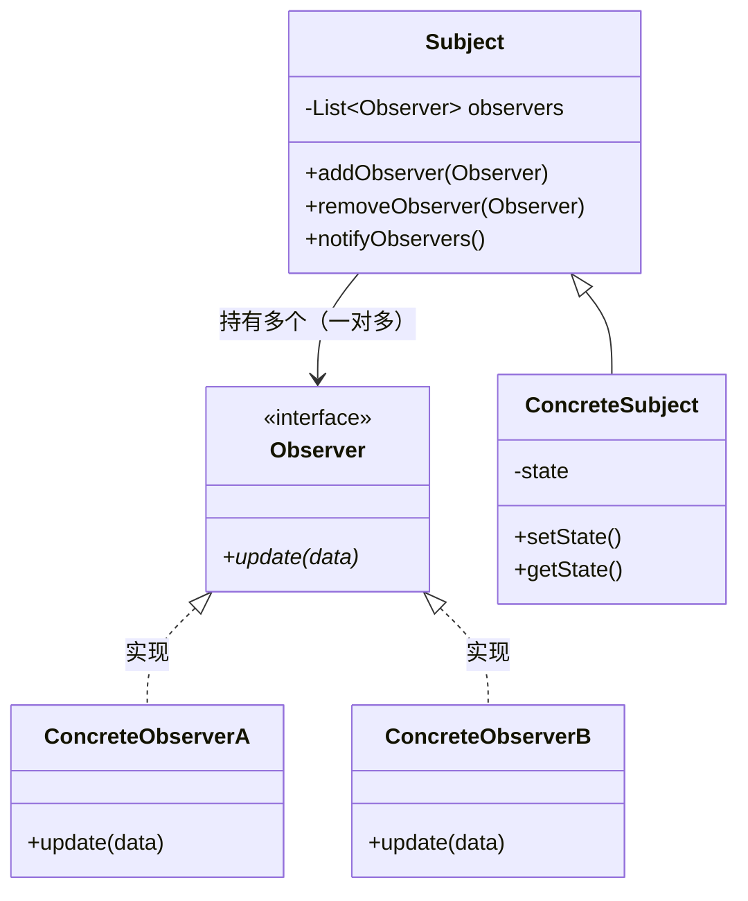
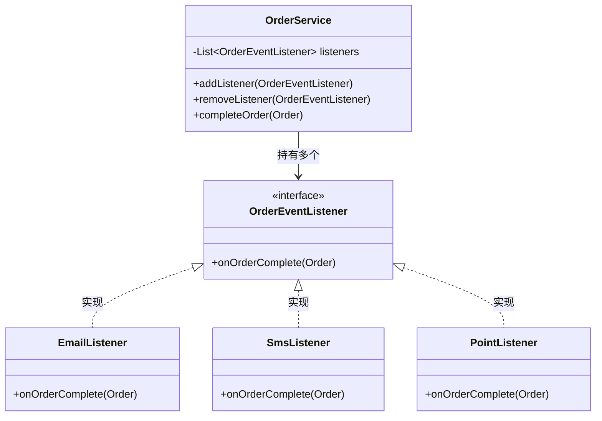

# 4.2 观察者模式 (Observer Pattern)

> 定义对象之间一对多的依赖关系，当一个对象状态改变时，所有依赖它的对象都会自动收到通知并更新。

---

## 1. 解决什么问题

一个对象的状态变化需要通知其他对象，但你不想让它们之间硬编码依赖。

```java
// 没有观察者模式：订单完成后，要通知各个模块
public class OrderService {
    private EmailService emailService;
    private SmsService smsService;
    private PointService pointService;

    public void completeOrder(Order order) {
        // 业务逻辑
        order.setStatus("completed");

        // 通知各方 —— 每加一个通知就要改这里
        emailService.send(order);
        smsService.send(order);
        pointService.addPoints(order);
        // 以后还要加物流通知？优惠券发放？继续改...
    }
}
```

问题：
- **强耦合**：OrderService 直接依赖所有下游模块
- **违反开闭原则**：每加一个通知方，就要改 OrderService
- **职责不清**：订单服务不应该关心谁要被通知

---

## 2. 角色与结构

- **Subject（主题/被观察者）**：维护观察者列表，状态变化时通知所有观察者。
- **Observer（观察者）**：定义接收通知的接口。
- **ConcreteSubject（具体主题）**：持有状态，状态改变时调用通知方法。
- **ConcreteObserver（具体观察者）**：实现收到通知后的具体处理。

类图：


核心：Subject 只依赖 Observer 接口，不认识任何具体观察者。

---

## 3. 与策略模式、命令模式的对比

| | 策略模式 | 命令模式 | 观察者模式 |
|---|---|---|---|
| 关系 | 一对一 | 一对一 | **一对多** |
| 封装的是 | 算法 | 请求 | **通知** |
| 核心动作 | 选一个执行 | 存起来、回放 | **广播给所有人** |
| 谁主动 | Context 主动调策略 | Invoker 主动触发命令 | Subject 主动通知 Observer |

---

## 4. Java 示例：订单完成通知

**场景**：订单完成后，需要发邮件、发短信、加积分，以后可能还会加更多。

```java
// 观察者接口
public interface OrderEventListener {
    void onOrderComplete(Order order);
}

// 具体观察者：邮件通知
public class EmailListener implements OrderEventListener {
    @Override
    public void onOrderComplete(Order order) {
        System.out.println("发送邮件通知: 订单" + order.getId() + "已完成");
    }
}

// 具体观察者：短信通知
public class SmsListener implements OrderEventListener {
    @Override
    public void onOrderComplete(Order order) {
        System.out.println("发送短信通知: 订单" + order.getId() + "已完成");
    }
}

// 具体观察者：积分服务
public class PointListener implements OrderEventListener {
    @Override
    public void onOrderComplete(Order order) {
        System.out.println("增加积分: 订单" + order.getId() + "奖励100积分");
    }
}

// 主题：订单服务
public class OrderService {
    private List<OrderEventListener> listeners = new ArrayList<>();

    public void addListener(OrderEventListener listener) {
        listeners.add(listener);
    }

    public void removeListener(OrderEventListener listener) {
        listeners.remove(listener);
    }

    public void completeOrder(Order order) {
        order.setStatus("completed");

        // 通知所有观察者 —— 不关心谁在监听、监听了几个
        for (OrderEventListener listener : listeners) {
            listener.onOrderComplete(order);
        }
    }
}

// 客户端
public class Client {
    public static void main(String[] args) {
        OrderService orderService = new OrderService();

        // 注册观察者
        orderService.addListener(new EmailListener());
        orderService.addListener(new SmsListener());
        orderService.addListener(new PointListener());

        // 完成订单 → 自动通知所有观察者
        orderService.completeOrder(new Order("10001"));
        // 输出:
        // 发送邮件通知: 订单10001已完成
        // 发送短信通知: 订单10001已完成
        // 增加积分: 订单10001奖励100积分
    }
}
```

新增一个"物流通知"，只需要：
```java
public class LogisticsListener implements OrderEventListener {
    @Override
    public void onOrderComplete(Order order) {
        System.out.println("通知物流: 订单" + order.getId() + "准备发货");
    }
}

// 注册一下
orderService.addListener(new LogisticsListener());
```

OrderService **一行都不用改**。

示例类图：


---

## 5. Spring 中的观察者模式

Spring 的事件机制就是观察者模式的完整实现，不需要自己维护观察者列表：

```java
// 1. 定义事件（相当于通知携带的数据）
public class OrderCompleteEvent extends ApplicationEvent {
    private final Order order;

    public OrderCompleteEvent(Object source, Order order) {
        super(source);
        this.order = order;
    }

    public Order getOrder() { return order; }
}

// 2. 发布事件（Subject 角色）
@Service
public class OrderService {
    @Autowired
    private ApplicationEventPublisher publisher;

    public void completeOrder(Order order) {
        order.setStatus("completed");
        publisher.publishEvent(new OrderCompleteEvent(this, order));
        // 不关心谁在监听
    }
}

// 3. 监听事件（Observer 角色）—— 加一个注解就行
@Component
public class EmailListener {
    @EventListener
    public void handle(OrderCompleteEvent event) {
        System.out.println("发送邮件: " + event.getOrder().getId());
    }
}

@Component
public class PointListener {
    @EventListener
    public void handle(OrderCompleteEvent event) {
        System.out.println("增加积分: " + event.getOrder().getId());
    }
}
```

Spring 帮你做了：
- 维护观察者列表（通过 IoC 容器自动发现 `@EventListener`）
- 广播通知（`ApplicationEventPublisher` 遍历所有监听者）

你只需要定义事件、发事件、加注解监听，完全不用手动注册。

---

## 6. JDK 和框架中的观察者模式

| 场景 | Subject | Observer |
|---|---|---|
| Swing 按钮点击 | `JButton` | `ActionListener` |
| Spring 事件 | `ApplicationEventPublisher` | `@EventListener` |
| MQ 消息队列 | 消息生产者 | 消息消费者 |
| Vue/React 响应式 | 数据（state） | 视图（组件） |

本质都是同一件事：**状态变了 → 通知所有关心的人**。

---

## 7. 优缺点

### 7.1 优点
- **解耦**：发布者不依赖具体订阅者，双方通过接口通信。
- **开闭原则**：新增观察者不修改主题代码。
- **灵活**：运行时动态添加/移除观察者。

### 7.2 缺点
- **通知顺序不可控**：观察者的执行顺序通常没有保证。
- **可能有性能问题**：观察者太多或处理太慢会拖累主题。
- **调试困难**：事件是隐式调用，代码里看不到直接的方法调用链，跟踪流程要靠经验。

---

## 8. 小结

观察者模式的核心价值是**解耦事件的发生和事件的处理**。

三种模式的中间层对比：

| 模式 | 中间层 | 解决的核心问题 |
|---|---|---|
| **策略模式** | Strategy 接口 | 算法可替换，消除 if-else |
| **命令模式** | Command 对象 | 请求可记录，支持撤销/队列 |
| **观察者模式** | Observer 接口 | 通知可扩展，一对多解耦 |

当你发现一个对象的变化需要通知多个其他对象，而且将来通知的对象可能会变，就是观察者模式的用武之地。
